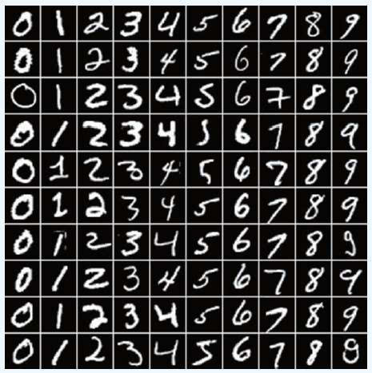
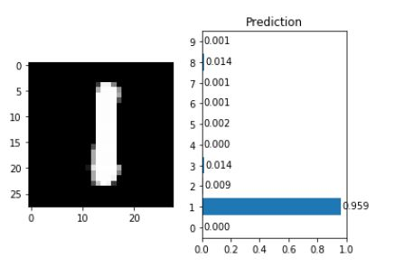

# Handwritten-digit-identification
Trained a neural network to identify handwritten digit

## About the Data
The dataset has a training set of 60,000 examples, and a test set of 10,000 examples.Each example is a 28x28 grayscale image. 

It is a good database for people who want to try learning techniques and pattern recognition methods on real-world data while spending minimal efforts on preprocessing and formatting. 

Members of the AI/ML/Data Science community love this dataset and use it as a benchmark to validate their algorithms. In fact, MNIST is often the first dataset researchers try. _"If it doesn't work on MNIST, it won't work at all",_ they said. _"Well, if it does work on MNIST, it may still fail on others."_

Here's an example how the data looks 

## Tools Used
The coding was done with Python 3.6.6, and following libraries were used:
* [Torch](https://pypi.org/project/torch/)
* [Torchvision](https://pypi.org/project/torchvision/0.1.8/)
* [Numpy](https://pypi.org/project/numpy/)
* [Matplotlib](https://pypi.org/project/matplotlib/)
* [Collections](https://docs.python.org/3/library/collections.html)

## Training Steps
1. Download datasets from [Torchvision](https://pypi.org/project/torchvision/0.1.8/)

2. Use Dataloader of Pytorch to load data,DataLoader can shuffle the data and accelerate training process

3. Build a network, choose a loss function and optimizer

4. Train the network

5. Use the trained network to identify digits from testing dataset

## Result
This neural network contains <strong>4 layers</strong>: _1 input layer_, _1 output layer_ and _2 hidden layers_.It performs pretty well.

